 
## 查看主页获取源码

> **作者介绍**： **✌**全网粉丝10W+本平台特邀作者、博客专家、CSDN新星计划导师、java领域优质创作者,博客之星、掘金/华为云/阿里云/InfoQ等平台优质作者、专注于项目实战 **✌**

  

### 一、作品包含

源码+数据库+设计文档万字+PPT+全套环境和工具资源+部署教程

### 二、项目技术

前端技术：Html、Css、Js、Vue、Element-ui

数据库：MySQL

后端技术：Java、Spring Boot、MyBatis

  

### 三、运行环境

开发工具：IDEA/eclipse

数据库：MySQL5.7

数据库管理工具：Navicat10以上版本

环境配置软件： JDK1.8+Maven3.6.3

前端Nodejs：14

### 四、项目介绍
项目编号：springbootA094

大学生成绩管理系统是一款专为高等教育机构设计的软件，旨在高效地记录、管理和分析学生的学术成绩，为教师提供便捷的成绩录入与查询服务，为学生提供透明的成绩获取途径，以提升教育质量和行政管理效率。

大学生成绩管理系统的管理员模块和学生模块的功能。

管理员模块包括系统首页、个人中心、班级管理、专业管理、学生管理、班级信息管理、课程分类管理、学生成绩管理和系统管理等功能。
学生模块包括系统首页、个人中心、班级信息管理、学生成绩管理和系统管理等功能。

### 五、运行截图

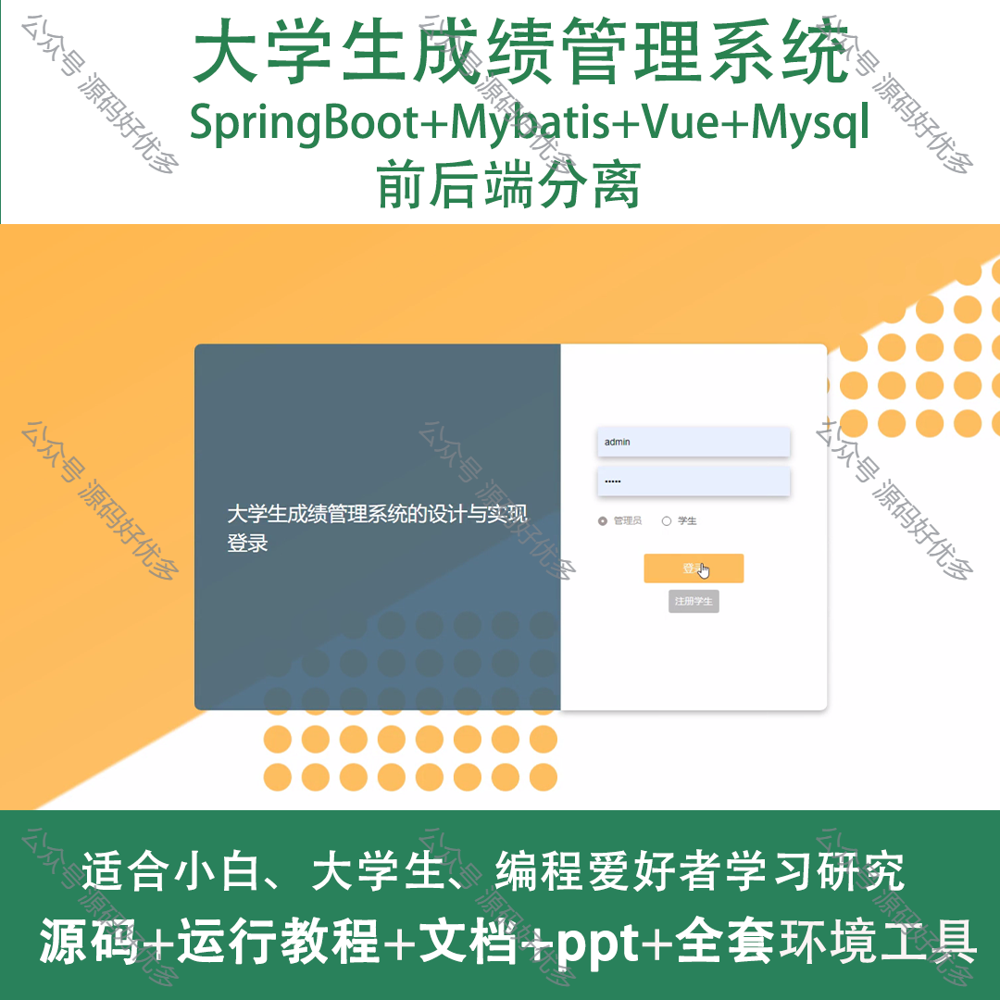
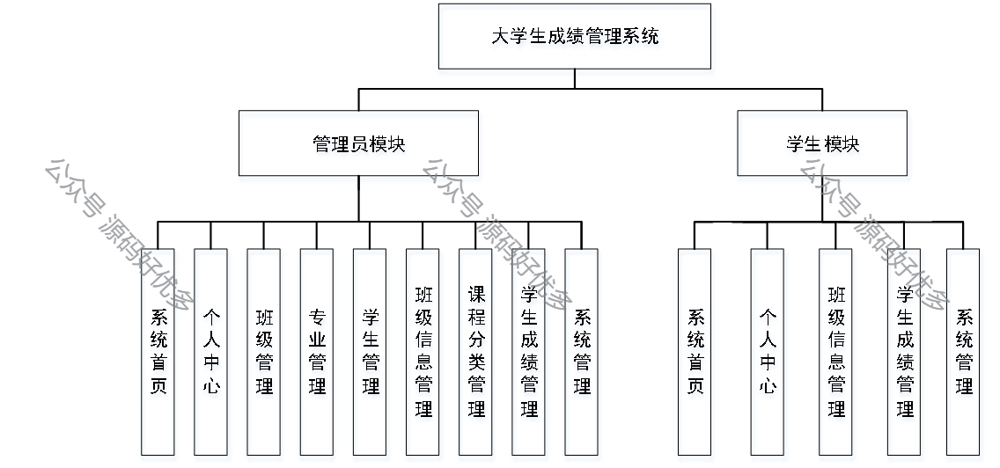
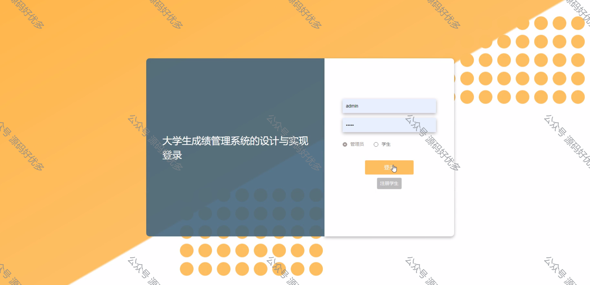
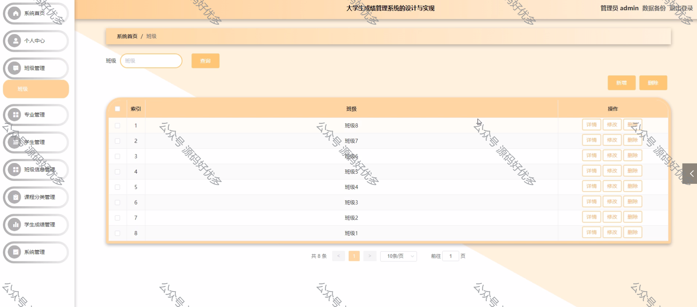
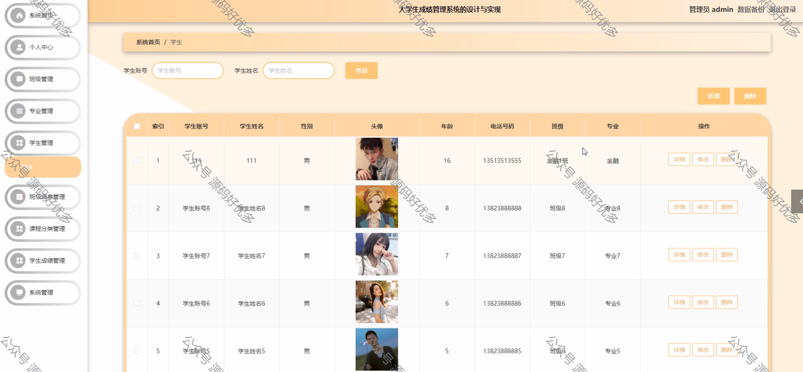
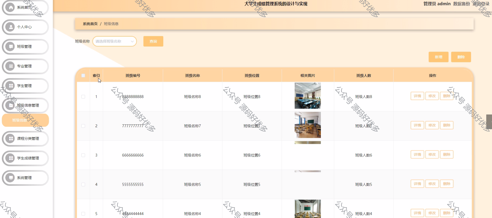
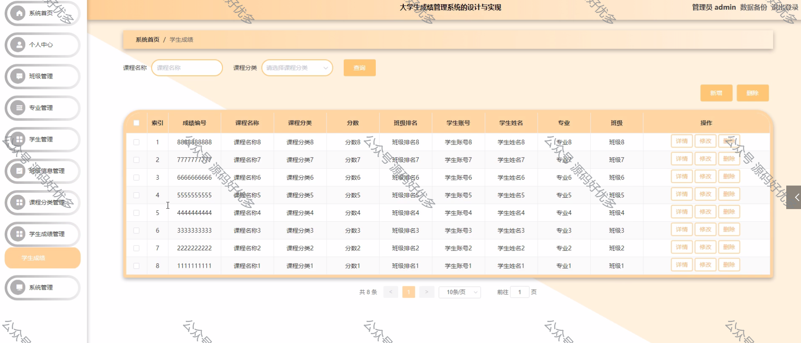
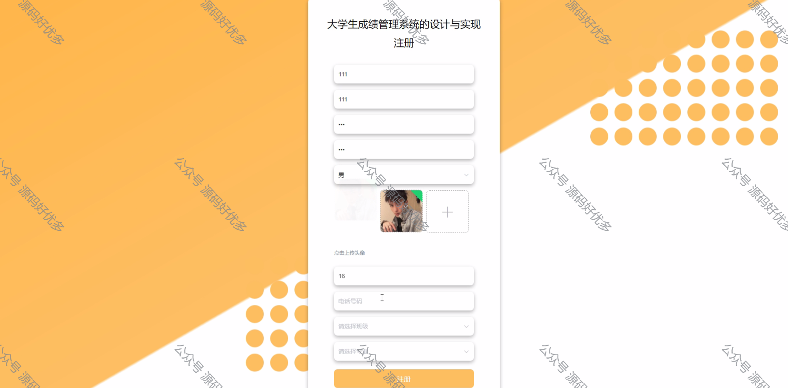
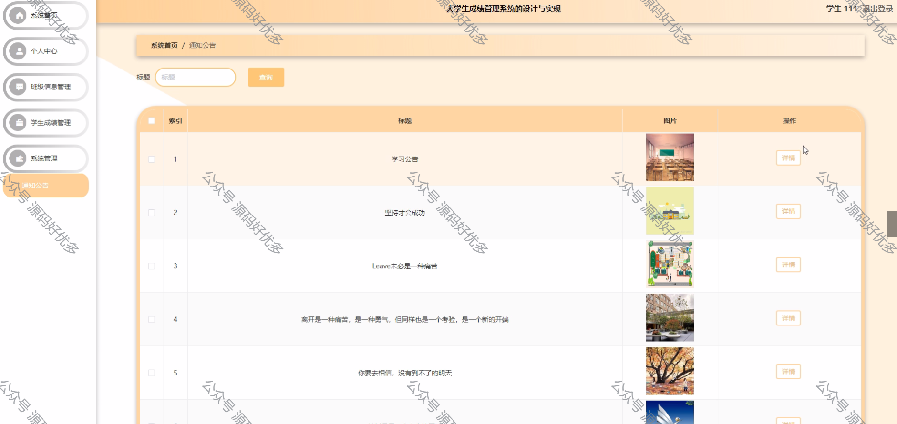
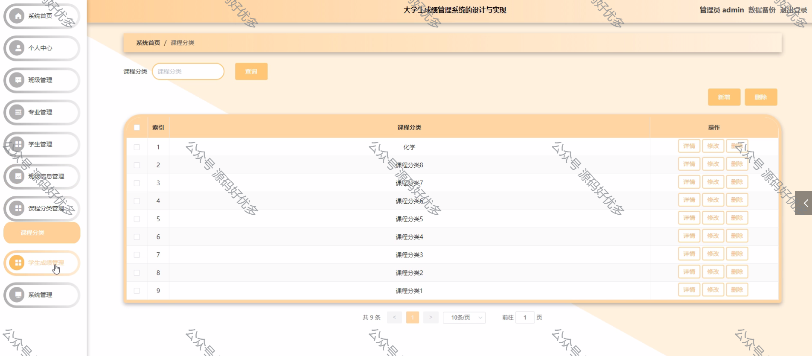
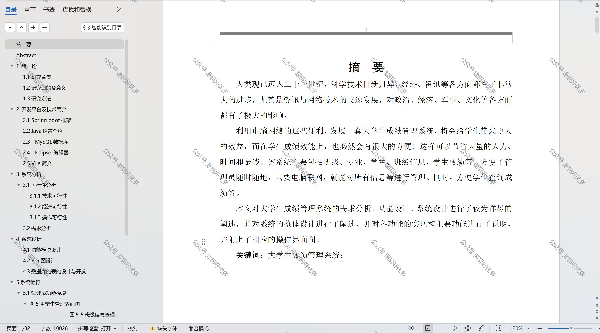

  
